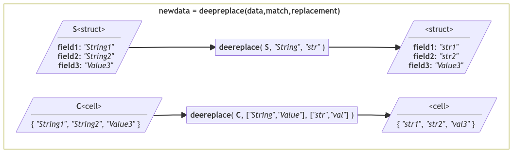

# *deepreplace*: Find and replace string segments in nested objects

[](https://github.com/WD40andTape/deepreplace)
[](https://uk.mathworks.com/matlabcentral/fileexchange/122687-deepreplace-replace-string-segments-in-nested-objects)

## Summary

`newdata = deepreplace(data,match,replacement)` replaces all occurrences of substring(s) `match` with `replacement` at any level of the nested object `data`.

[](https://mermaid.live/edit#pako:eNq9VE1r4zAQ_StCCyEFF5P25ri-tBQWWgob2Eucg2yNY4Ese5VRSwn57zv-qO2ExKQsrA7Gns_nN6O352kpgQc80-VHmguLjL38ig2js3PJ1ooqZ4VQZh3zMIkMfEiBgj0wCVBZqLRIYV6bvEJgmnudqQCDN6GfRDOT7Krl9DPmm7ZhfaSykKIqTQ-jgYLWpfjTrP0GxqoprXHZ2mdbXIa59SNyZQq0XNT-gIUqmv1xJS5XaJXZLtqP0FdnYIWJZUOBu7MF7q4vcH9S4LfQDu6n8mPub05_-Nl1vBPbHbN13Tn74sA7hTh0GLmo2GBnN0d8t43eHNbUfoNSCvsHPin7P5KZgtb97jx-7U5t7X9zP7Es3sQeeJdRscM1uKZG_NiOeH15xsfNB8dmnHU0_iHlXehRwsla1NBGS3GJq-Mt8C4NeOSgrldzBEZ2StRdf3Z7Gw1XY_RFUNvIdtSNp2O3f-9jdvipoRE1limtgx9Zc7jHC7BkliSH-zo05piTlMU8oFcJmXAaYx6bA4UKh-Xq06Q8IADgcVeRCsKTEiSZBQ8yoXdkBamwtK-txDZKe_gLOIjDOw)

### Inputs

- `data` can be of any class but will only undergo replacement when it contains text, i.e. string array or character vector, at any hierarchical level.
- `match` must be a text or pattern array.
- `replacement` must be text. It must be the same size as `match` or be scalar.

### Output

- `newdata` is the same class as `data`. All nonoverlapping occurrences of each element of `match` in `data` are replaced by the corresponding element of `replacement`.

### Examples

```MATLAB
DATA = { '2022-12-8', 5; '2022-12-9', 9 };
MATCH = [ "-", "2022" ];
REPLACEMENT = [ "/", "22" ];
deepreplace( DATA, MATCH, REPLACEMENT )
-----
ans = 2×2 cell array:
    {'22/12/8'} {[5]}
    {'22/12/9'} {[9]}
```

```MATLAB
username = 'Default';
Directories.matlab = { 'C:\Program Files\MATLAB', ...
    'C:\Users\<user>\Documents\MATLAB' };
Directories.labrat = 'C:\Users\<user>\Documents\LABRAT';
Directories = deepreplace( Directories, '<user>', username )
-----
Directories = struct with fields:
    matlab: { 'C:\Program Files\MATLAB', ...
                'C:\Users\Default\Documents\MATLAB' }
    labrat: 'C:\Users\Default\Documents\LABRAT'
```

More examples available in [*examples.mlx*](examples.mlx) / [*examples.pdf*](examples.pdf).

## Compatibility, License and Citation

Created in 2022b. Compatible with MATLAB release 2019b and later. Compatible with all platforms.

Published under MIT License (see [*LICENSE.txt*](LICENSE.txt)).

Please cite George Abrahams (https://github.com/WD40andTape/fieldfun, https://www.linkedin.com/in/georgeabrahams).
